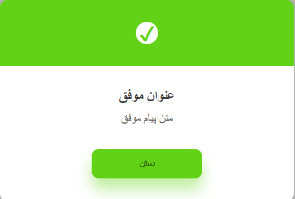

# Persian Alert — Simple JavaScript Notification / Popup Library

A lightweight JavaScript-based notification system for displaying modal-style alerts with customizable content, appearance, and behaviors — built for Persian (Farsi) language UI.

## 

## 🚀 Features

- 🧾 Custom messages & descriptions
- ✅ Supports `success`, `error`, `warning`, and `info` alert types
- 🧠 Optional confirm button with callback
- ⏲️ Auto-dismiss via timeout
- 🖼️ Dynamic icons and styling based on alert type
- 📌 Position control for flexible UI placement
- 💡 Pure JavaScript (no dependencies)

---

## 💾 Installation

Simply include `alert.js` in your project:

```html
<script src="./alert.js"></script>
```

And make sure the required CSS classes (`bg_success_modal`, `slidInDownAnimation`, etc.) exist in your stylesheet.

---

## 💡 Usage

Call `persianAlert()` with an options object:

```javascript
persianAlert({
  message: "عملیات موفق بود!",
  description: "دیتای شما با موفقیت ذخیره شد.",
  alertType: "success", // success | error | warning | info
  position: "top_modal", // optional: custom CSS class
  timeout: 3000, // optional: auto close in ms
  buttonTextClose: "بستن",
  showButtonClose: true,
  enableConfirm: true,
  onConfirm: function () {
    console.log("User confirmed the alert.");
  },
});
```

---

## 🧩 Options

| Property          | Type       | Description                              | Default         |
| ----------------- | ---------- | ---------------------------------------- | --------------- |
| `message`         | `string`   | The title text of the alert modal        | —               |
| `description`     | `string`   | Additional description or explanation    | —               |
| `alertType`       | `string`   | `success`, `error`, `warning`, or `info` | `info`          |
| `position`        | `string`   | Custom CSS class for modal position      | `center_modal`  |
| `timeout`         | `number`   | Auto close alert after X milliseconds    | `null` (manual) |
| `buttonTextClose` | `string`   | Text for the close button                | `بستن`          |
| `showButtonClose` | `boolean`  | Whether to show the close button         | `true`          |
| `enableConfirm`   | `boolean`  | Show an extra confirm button             | `false`         |
| `onConfirm`       | `function` | Callback when confirm button is clicked  | `undefined`     |

---

## 💡 Closing the Alert

You can also close the alert manually using:

```javascript
alertClose();
```

---

## 🧾 License

MIT — Free to use for personal and commercial projects.

---

## ⚡️ Author

Crafted with ❤️ for Persian web applications.

---
